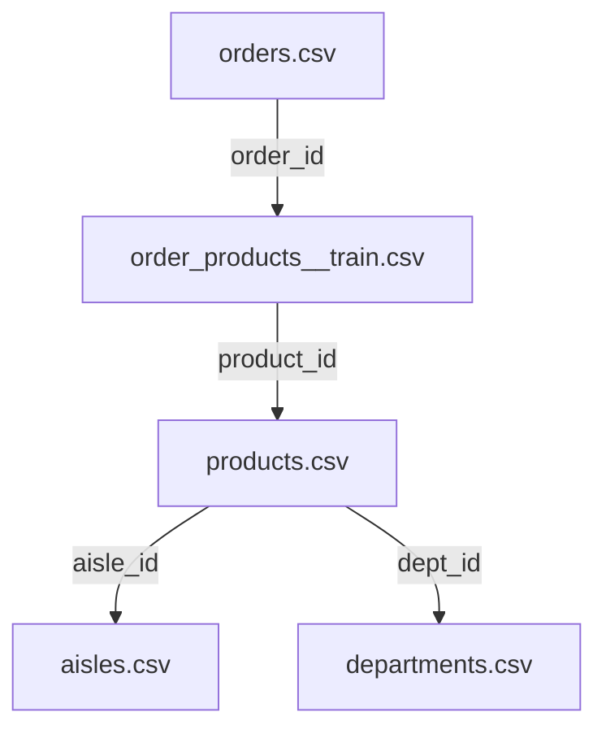

# Instacart Dataset Analysis & Transformation

## 1. Source Data Structure
The original dataset consists of 6 relational CSV files:

| File | Key Columns | Description |
| :--- | :--- | :--- |
| `orders.csv` | `user_id`, `order_id`, `order_dow`, `order_hour` | When and who made the order |
| `products.csv` | `product_id`, `product_name` | Catalog of 50k+ items |
| `order_products` | `order_id`, `product_id`, `add_to_cart_order` | Items inside each basket |
| `aisles/depts` | `aisle`, `department` | Category metadata (e.g., "produce", "dairy") |

---

## 2. Transformation Pipeline
The `prepare_instacart.py` script performs the following "Denormalization" to create a flat, analysis-ready file:

### Steps:
1.  **Filtering:** Selected `order_products__train` (~1.3M rows) to get the most recent snapshot for every user.
2.  **Enrichment:** Merged Products with Aisles and Departments to move from IDs to readable names.
3.  **Joining:** Linked item-level data with order-level data (`user_id`, `time`, `recency`).
4.  **Cleaning:** Renamed columns to intuitive aliases (e.g., `order_dow` → `day_of_week`).

---

## 3. Output: `clean_data.csv`
Designed for **Market Basket Analysis** and **Trend Prediction**.

| Feature | Analysis Value |
| :--- | :--- |
| **`user_id`** | Track individual shopping habits over time |
| **`product_name`** | Identify frequent item pairings (Correlations) |
| **`aisle/dept`** | High-level category trends (e.g., "Morning vs Evening" departments) |
| **`day_of_week`** | Seasonal/Weekly cycle patterns |
| **`hour_of_day`** | Daily peak usage patterns |
| **`is_reorder`** | Distinguish between "trial" and "habit" purchases |

---

## 4. Usage for Prediction
*   **Correlations:** Use `order_id` + `product_name` to find items bought together (Association Rules).
*   **Trends:** Group by `day_of_week` or `hour_of_day` to see when specific categories (e.g., "breakfast") spike.
