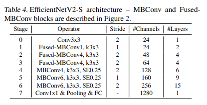
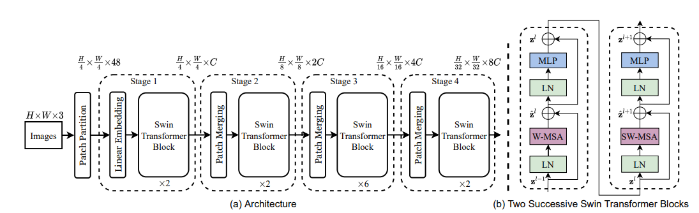
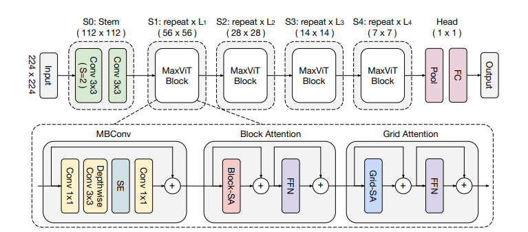

# Task 2 Experiement Approach
[**SEE RESULTS SUMMARY**](#results)
## Metrics of Success
ID val is over-saturated; selection is based on:
1. **OOD validation accuracy (primary)**
   - Reflects deployment aims - how often can it predict correctly?
2. **OOC AUC-ROC (Secondary)**
   - Is it acting on the right information to distinguish classes?
3. **OOD ECE (Tertiary)**
   - Is the confidence value reliable?

## Experiment Steps

1. Identify best dataset variation using EfficientNet STL baseline (deduplication, pre-augmentation)
2. Identify best STL architecture at fixed optimizer (AdamW): EfficientNet vs Swin vs MaxViT
3. On winning arch, MTL vs STL with unified stopping criterion (primary-task loss)
4. On winning arch, architectural ablations:
   - freeze / partial-freeze (last body stage) / finetune
   - pretrained / random-init
   - class-weighted / unweighted loss
5. Augmentation ablation on best config from (4)
6. Post-hoc: temperature scaling on val > OOD ECE 

# Model Architectures
### EfficientNetV2-S

### Swin-T

### MaxViT

# Results

